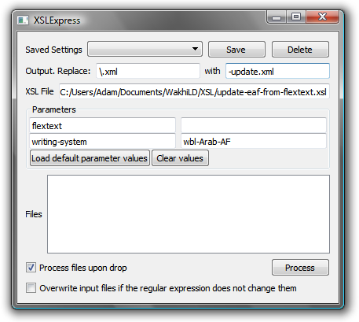

XSLExpress
------------

XSLExpress is a tool for performing XSL transformations quickly, with a reasonably intuitive GUI. It is very helpful for performing transformations in batches.




*   Run an XSL transformation:
    *   Drag the XSL file into the _XSL File_ field (or type in the path).
    *   Drag the input files into the _Files_ field. If “Process files upon drop” checkbox is checked, the files will be processed automatically.
    *   Click _Process_ to process the files in the _Files_ field without having to drag-and-drop again.
*   Change output filenames
    *   The _Replace ... with ..._ fields require regular expressions for transforming the input filenames into the output filenames (note that symbols like period, backslash, etc. need to be escaped). The default changes myfile.xml to myfile-output.xml
    *   If you botch your regular expression and the input and output filenames would be the same, XSLExpress will not overwrite the original file. If you want the original files to overwritten, check _Overwrite input files if the regular expression does not change them_.
*   Supply parameters
    *   Parameters and their default values are loaded when you drop in a new XSL file.
    *   Send parameters to your XSL file by filling in the fields “Parameter name” and “Parameter value”.
    *   Click _Load default parameters values_ to refresh the parameter values according with the default values.
    *   Click _Clear values_ to clear the parameter values.
*   Save your settings
    *   Click _Save_ to save your current settings with a certain name (e.g., if you want to reuse parameter values or the replacement expressions later).
    *   Click _Delete_ to remove the current settings.
    *   To restore previously saved settings, simply select them from the _Saved Settings_ drop-down.

Tip
---

If you want the output of the operation to be an entirely different filename from the input (but in the same folder), the regular expression for that is not immediately obvious. You want to replace:

`^(.*)/.*$`

With:

`\1/my-favorite-filename.xml`

Downloads
---------

XSLExpress is created with the [Qt application framework](https://www.qt.io/), released under the GNU Public License. That means, among other things, that you are free to download it and use it, but not to re-sell it.

Qt is a cross-platform framework, so there is the possibility for using this on Mac OS X, Linux, etc. Right now I only have Windows executables because I only have a Windows machine. Perhaps some do-gooder will build versions for other operating systems and send them to me.

### Source code

I build in Windows with this, which assumes that Qt is installed and visible in your path:

```
qmake -config release
mingw32-make
```

Of course your system would have something different from “mingw32-make”—probably just “make”—if you are not building from Windows using MinGW.
